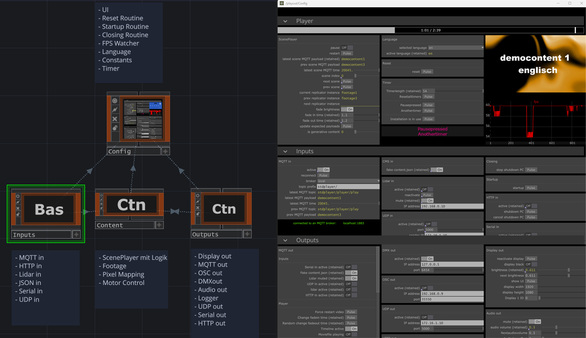

# td_project_template

Standard boilerplate setup for repetitive tasks in media installations with lots of communication to different software and hardware, made using TouchDesigner.
Clearly arranged structure for easy orientation, especially for people who have not developed the playout themselves.


## Main structure:

*  op.Inputs (on the left in the root): incoming data, eg. content.json from CMS syncer, sensors, incoming messages (http, mqtt)
*  op.Outputs (on the right in the root): outgoing data, eg. op.Projection_out, op.MQTT_out, op.Audio_out, op.DMX_out, op.OSC_out, op.Logger
*  op.Config: UI, FPS view, persistent variables, start / end / reset routine, language selector
*  op.Content: contains the logic for the player, eg. the basic player functionality in op.ScenePlayer. Dynamic mediafile recognition from CMS when a corresponding MQTT command arrives




## Main features

*  Python **logger integrated**
* play **video files and generative content**
*  Store **persistent customer configurations** as retained MQTT messages on the MQTT broker without the need to save a new software version or the need to use a database. Restore the settings automatically when starting again.
*  optimized for **AV playout**, optimal DMX data preparation
*  fully **remote-controllable via MQTT** (eg. from Node-Red)
*  shutting down the computer for incoming HTTP request
*  Project divided into several individually **trackbale .tox files*. Python scripts are also excluded as **trackable .py files**
*  AV sync
*  you can add themes from Strapi CMS (via content.json file) without needing to change the TouchDesigner scene
*  timeout timer
*  timeline grabber for video debugging


## Usage

The player starts in Perform mode. 
*  Press key 8 and 9 simultaneously to show the UI


### Integrate content

You store your files in the Assets directory.
Global entry point is `op.CMS_in` no matter if you use a CMS for file sync or not.  
The JSON file uses the syntax of Strapi CMS, so you coult easily link Strapi to this application.
In every section you define

*  the MQTT identzifier (`mqtt_message`) which is used to trigger the video from outside the application: Topic: `[topic_prefix]player/play`, Payload: `<my_MQTT_identifier`
*  the info if you are triggering a video file or a generative content
*  The references to the files for different languages.
*  the info if your video file is being looped
*  if the video file is not looped: which video is the next one?


This is an example JSON file.
```
[
    {
        "id": 1,
        "mqtt_message": "democontent1",
        "Looped": 1,
        "Successor": 0,
        "is_generative_content": 0,
        "localizations": {
            "en": {
                "Video": {
                    "url": "C:/Git/td-standardplayer/Assets/democontent1_en.mp4"
                },
                "Extra": {
                    "url": "C:/Git/td-standardplayer/Assets/1.mp4"
                }
            },
            "de-CH": {
                "Video": {
                    "url": "C:/Git/td-standardplayer/Assets/democontent1_de.mp4"
                },
                "Extra": {
                    "url": "C:/Git/td-standardplayer/Assets/2.mp4"
                }
            }
        }
    },
    {
        "id": 2,
        ...
    }
]
```

You can find most of the player logic in `op.ScenePlayer`.


## Color conventions

*  orange: container with important content
*  pink: in and outgoing data which is linked to / from another place
*  blue: value should / can be changed
*  yellow: info


# To Do Documentation


*  AV sync
*  Vide und generativen content anlegen
* remove up and down (next / prev scene)
*  cms workflow


## API / Communication

MQTT list for incoming messages (remote control):

`[topic_prefix]` is individual for each project, eg. `dew/materialien/`. 
`[topic_prefix]reset` means `dew/materialien/reset`


### Inputs

|  action                             |  topic                                     |  payload          |  retained      |  affects                              |  more info
|-------------------------------------|--------------------------------------------|-------------------|----------------|---------------------------------------|--------
|  activate **Serial in**             |  `[topic_prefix]serialin/active`           |  `1` or `0`       |  retained      |  op.Serial_in.par.Active              |  eg. wired Arduinos  
|  use a **fake json** assets file    |  `[topic_prefix]cms/use_fake_contentjson`  |  `1` or `0`       |  retained      |  op.CMS_in.par.Fakecontentjson        | in case no *CMS / JSON* data is available: use a fake json file (for development only)  
|  activate **lidar sensor**          |  `[topic_prefix]serialin/active`           |  `1` or `0`       |  not retained  |  op.Lidar_in.par.Active               | if Lidar sensor is part of the installation connected   
|  mute lidar sensor                  |  `[topic_prefix]lidar/mute`                |  `1` or `0`       |  retained      |  op.Lidar_in.par.Mute                 |  independent from active /inactive  
|  reactivate lidar                   |  `[topic_prefix]lidar/reactivate`          |  *egal*           |  not retained  |  op.Lidar_in.par.Reactivate   
|  activate **udp in** communication  |  `[topic_prefix]udpin/active`              |  `1` or `0`       |  retained      |  op.UDP_in.par.Active
|  activate **http in** communication |  `[topic_prefix]udpin/active`              |  `1` or `0`       |  retained      |  op.HTTP_in.par.Active


### Outputs

| action                              | topic                                      | payload           |  retained ?    |  affects                               |  more info
|-------------------------------------|--------------------------------------------|-------------------|----------------|----------------------------------------|--------
|  reactivate display                 |  `[topic_prefix]display`                   |  `reactivate`     |  not retained  |  op.Display_out.par.Reactivatedisplay  |  
|  make display black                 |  `[topic_prefix]display/black`             |  `1` or `0`       |  not retained  |  op.Display_out.par.Displayblack       |  
|  define display brightness          |  `[topic_prefix]display/brightness`        |  `1` or `0`       |  retained      |  op.Display_out.par.Brightness         |  
|  mute audio                         |  `[topic_prefix]audio/mute`                |  *egal*           |  retained      |  op.Audio_out.par.Mute                 | 
|  define audio volume                |  `[topic_prefix]audio/volume`              |  `1` or `0`       |  retained      |  op.Audio_out.par.Audiovolume          | 
|  Activate / deactivate DMX out      |  `[topic_prefix]dmxout/active`             |  `1` or `0`       |  retained      |  op.DMX_out.par.Active                 |  
|  Activate / deactivate OSC out      |  `[topic_prefix]oscout/active`             |  `1` or `0`       |  retained      |  op.OSC_out.par.Active                 |  
|  Activate / deactivate UDP out      |  `[topic_prefix]udpout/active`             |  `1` or `0`       |  retained      |  op.UDP_out.par.Active                 | 
|  Activate / deactivate HTTP out     |  `[topic_prefix]httpout/active`            |  `1` or `0`       |  retained      |  op.HTTP_out.par.Active                | 
|  Activate / deactivate Serial out   |  `[topic_prefix]serialout/active`          |  `1` or `0`       |  retained      |  op.Serial_out.par.Active              | 


### Player operations

| action                              | topic                                      | payload           |  retained ?    |  affects                               |  more info
|-------------------------------------|--------------------------------------------|-------------------|----------------|----------------------------------------|--------
|  pause video                        |  `[topic_prefix]player`                    |  `pause`          |  not retained  |  op.ScenePlayer.Pause()                |  
|  continue video                     |  `[topic_prefix]player`                    |  `continue`       |  not retained  |  op.ScenePlayer.Continue()             | 
|  restart video                      |  `[topic_prefix]player`                    |  `force_restart`  |  not retained  |  op.ScenePlayer.Restart()              | 
|  blackout                           |  `[topic_prefix]player`                    |  `blackout`       |  not retained  |  op.ScenePlayer.par.Fadebrightness=0   | 
|  play next scene                    |  `[topic_prefix]player`                    |  `next_scene`     |  not retained  |  op.ScenePlayer.par.Nextscene          | 
|  play previous scene                |  `[topic_prefix]player`                    |  `prev_scene`     |  not retained  |  op.ScenePlayer.par.Prevscene          | 
|  play scene by name                 |  `[topic_prefix]player/play`               |  `<video name>`   |  retained      |  op.ScenePlayer.PlayScene()            |  string (incoming MQTT payload)
|  pause video (2nd option)           |  `[topic_prefix]player/pause`              |  `1` or `0`       |  not retained  |  op.ScenePlayer.PlayScene()            | 
|  define fade in time                |  `[topic_prefix]player/fadeintime`         |  float-Wert       |  retained      |  op.ScenePlayer.par.Fadeintime         | 
|  define fade out time               |  `[topic_prefix]player/fadeouttime`        |  float-Wert       |  retained      |  op.ScenePlayer.par.Fadeouttime        | 
|  define timer length                |  `[topic_prefix]timer/timerlength`         |  float-Wert       |  retained      |  op.Timer.par.Timerlength              | 
|  Reset                              |  `[topic_prefix]reset`                     |  *egal*           |  not retained  |  op.Reset.ResetRoutine()               | 
|  language                           |  `[topic_prefix]language`                  |  `de` or `en`     |  retained      |  op.Language.par.Selectedlanguage      | 


### App operations

| action                              | topic                                      |  payload          |  retained ?    |  affects                               |  more info
|-------------------------------------|--------------------------------------------|-------------------|----------------|----------------------------------------|--------
|  activate / pause TD timeline       |  `[topic_prefix]app/active`                |  `1` or `0`       |  not retained  |  op.Health.par.Timelineactive          |  
|  activate / pause timeline          |  `[topic_prefix]app`                       |  `shutdownpc`     |  not retained  |  op.Closing.ShutDownPC()               |  
|  activate display output and UI     |  `[topic_prefix]app`                       |  `show_display_ui`|  not retained  |  op.Display_out.par.Showui.pulse()     |  geht auch: 8 und 9 gleichzeitig drücken


**HTTP Request**

Shutting down PC: `http://[name_or_ip_of_this_pc]:9981` (-> in op.HTTP_in)